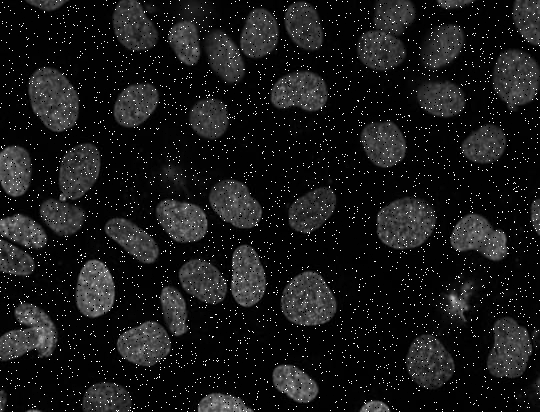
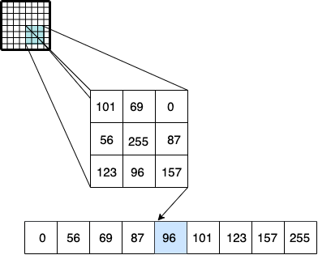
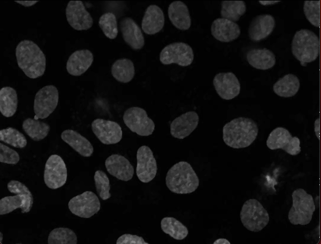
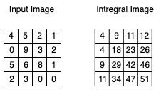
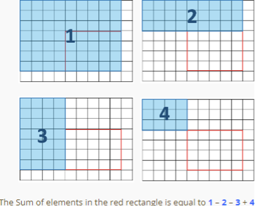
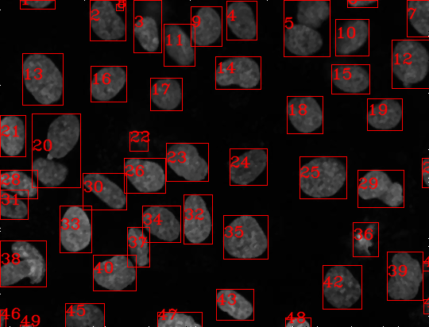
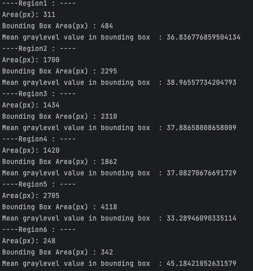
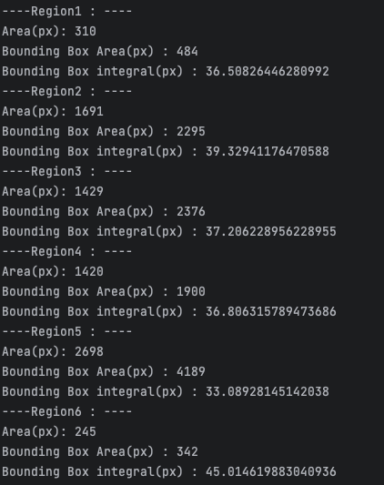

# COMPUTERS VISION PROJECT 1
This is a project in the context of the course "**Computers Vision**", 
 Democritus Universitry Of Thrace.
***

In this work, we have to:
1.  remove noise from an image and detect  all different objects.For every object we have to design a bounding box and a unique serial number.
1. For every cell we have to measure and present  :
    - a. The surface of the cell, defined as the number of pixels that belong to this.
    - b. The surface of bounding box of the cell , as number of pixels.
    - c. The average grayscale rating  value of the pixels in the bounding box, in such a way that the execution speed must be independent of subregion's size.

The image we will proccess is the following .

***
## MEDIAN FILTER
The starting image contains noise and we must denoize it.

We choose to implement _MEDIAN FILTER_, a nonlinear filter in which each output sample is computed as the median value of the input samples under the window.The result is the middle value after the input values have been sorted.

${\boxed{ \hat{f}(x,y)=median_{(s,t)\in S_{x,y}}[g(s,t)] } }$
 

In more detail, we create a ${3x3}$ kernel that runs through the image. For  every iteration, compute the median value and change the specific pixel.

 We call " median_filter " function  and the denoised  image  is the  following.

We understand that despite removing  noise , we might lose some information-detail from the image.
***

## INTEGRAL IMAGE

Next functions of the code  are _"my_integral"_ and _"integral_sum"_. 

Integral image is where pixel represents the cumulative sum of corresponding input pixel with all pixels above and left of the input pixel.The concept is that we calculate it once and after that we can make every computation in constant time. It enables rapid calculation of summations over image sub-regions. So the computational complexity is ${O(1) }$ instead of  ${O(n)}$. We will use integral image for some statistical measures later. 

Here is an example of a random matrix:

After computing integral image , function _"integral_sum"_  calculating  sum of a region  by formula:

${Sum=Bottom \ right + Top \ left - Top \ right - Bottom \ left= 1 + 4 -2 -3}$

***

## IMPLEMENTATION

At next step we will use the default function _"connectedComponentsWithStats"_.

We gave as input the denoised image converted to binary with a specific threshold.The default function returns a matrix with 4 cells:
1. The number of labels-objects.
1. The label matrix, an array with a unique number for each object.
1. The stat matrix. Coοrdinates of each bounding box:
   - STAT_LEFT   :  box start in y dimension ${x1}$
   - STAT_TOP    :  box start in x dimension ${y1}$
   - STAT_WIDTH  :  box width ${w}$
   - STAT_HEIGHT :  box height ${h}$
   - STAT_AREA   :  component's area in pixels. ${area }$
1. The centroid matrix. Coordinates of the center of each area.

## 2.a-b
We add a threshold and  run throught the components.

With help of stat matrix and STAT_AREA (${area}$) we can find number of pixels in each component.

Continuing with stat matrix we can find the coordinates of each bounding box ${(x1+w,y1+h)}$ ,and the surface that is equal to (${w*h}$) .

## 2.c

Afterward we are looking for the average grayscale rating value of the pixels in the  bounding box. This value is equal :

${\boxed{average=\frac{sum \ of \ pixels}{number \ of \ pixels}=\frac{sum}{w*h} }}$ 

We will use integral image to find sum of pixels in each bounding box.

So we call _"integral_sum "_ with arguements:
1. blur image
1. $y1$ 
1. $x1$
1. $y1+h$
1. $x1+w$

and find the sum for each box.
***

We design in the new denoised image the bounding box for every compoonent with the default function of OpenCV _"cv2.rectangle"_ with inputs:
1. blur image
1. coordinates of bounding box 
1. box color 
1. box thickness

, and we number each component with _"cv2.putTex"_ with arguements:
1. blur image
1. text
1. coordinates 
1. font 
1. fontScale
1. color 
1. thickness.

***

Finally we return the  following image.

And this is an example of of requested informations.

*** 

## ORIGINAL 

We make the same procedure,except from median filter part, for the original image (without noise). The results we get are the following:

***

## CONCLUSIONS

 The two final images have  qualitive differences :

 1. We observe a relatively small difference at area(pixels) but not for all connected components.
 1. Also a small divergence at pixels in the bounding box of each component.
 1. A divergence at average grayscale rating for every component.

The erros are due to :

1. possible failures of the methodology:

   1.  Median filter implementation might lose some information from the image.
   1.  Not propert threshold implementation   to convert denoised image to binary.
   1.  Not propert theshold implementation to dismiss some components(areas).

2. possible failures due to images features:
   1. In some areas we have something like noise that considered from _"cv2.connectedComponentsWithStats"_ a component. For example that happens in the boxes 22 and 36.

